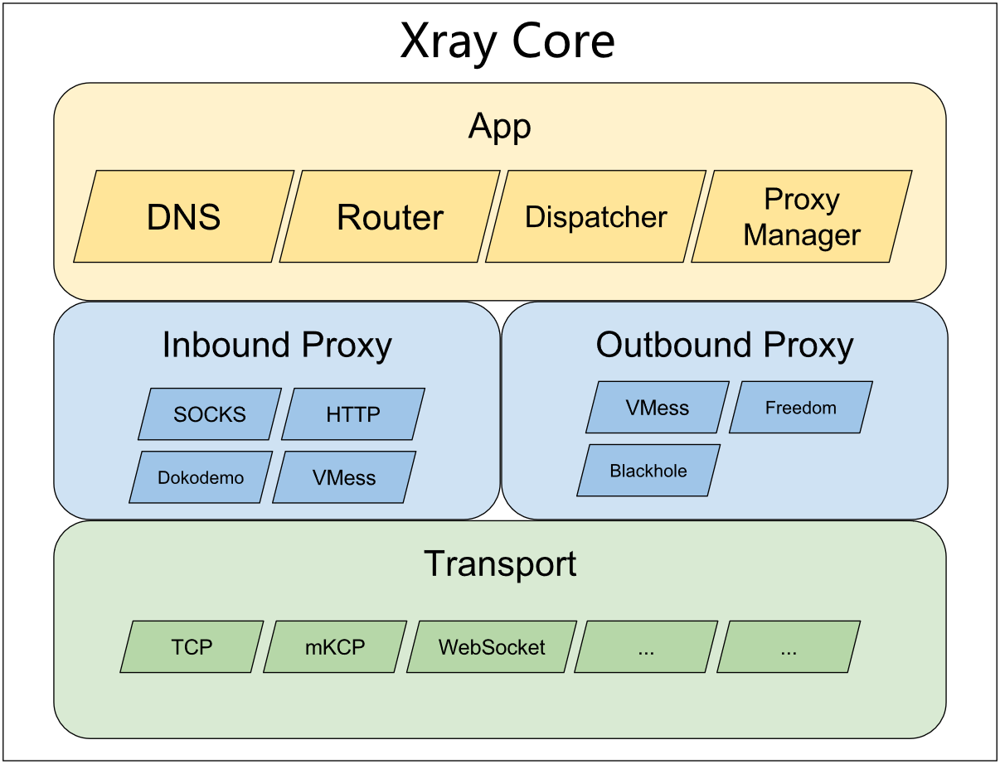

# 系统架构

内核分为三层：应用层、代理层和传输层  
*具体的可以参考[官方文档](https://xtls.github.io/development/intro/design.html)*
# 代码流程
通过命令启动各种服务来实现各种功能  
## 配置加载  
配置文档中的配置项定义在[这里](infra\conf\xray.go)，程序通过[Build](infra\conf\xray.go)将面向用户的配置结构转换为[程序中的配置](core\config.pb.go)结构。其实就是创建各配置/模块/服务的结构体实例。
## `core.Config`结构分析  
这个就是内核配置了，相对于配置文件中的配置，字段少了很多，当前版本在用的如下
```
    // Inbound handler configurations. Must have at least one item.
	Inbound []*InboundHandlerConfig `protobuf:"bytes,1,rep,name=inbound,proto3" json:"inbound,omitempty"`
	// Outbound handler configurations. Must have at least one item. The first
	// item is used as default for routing.
	Outbound []*OutboundHandlerConfig `protobuf:"bytes,2,rep,name=outbound,proto3" json:"outbound,omitempty"`
	// App is for configurations of all features in Xray. A feature must
	// implement the Feature interface, and its config type must be registered
	// through common.RegisterConfig.
	App []*serial.TypedMessage `protobuf:"bytes,4,rep,name=app,proto3" json:"app,omitempty"`
	
	// Configuration for extensions. The config may not work if corresponding
	// extension is not loaded into Xray. Xray will ignore such config during
	// initialization.
	Extension []*serial.TypedMessage `protobuf:"bytes,6,rep,name=extension,proto3" json:"extension,omitempty"`
```
本质和用户配置没有太大区别，只是把很多模块移到了`App`字段中。配置加载的时候，会通过调用各模块的`Build()`方法实例化各模块，然后加入`App`中。  
## 服务初始化及启动
配置加载完成后，根据`core.Config`实例化[`core.Instance`](core\xray.go)，在此过程中，程序会将`App`字段里面的配置转换成`core.Instance`里面的`Features`。启动时，`core.Instance`会调用[`Start()`](core\xray.go)方法，此方法会循环调用`Instance.Features.Start()`，所以启动时，本质上是启动了各模块的服务。
### 模块列表
要分析有哪些模块，直接看配置无法与代码对应上，需要从代码流程一步步分析  
- `core.Config.App`  
上面已经分析了，配置文件会先转化为`core.Config`结构，`App`中包含了除`Inbound`和`Outbound`外的所有配置，具体如下  
  - dispatcher
  - proxyman.Inbound
  - proxyman.Outbound
  - api
  - metrics
  - stats
  - log
  - router
  - dns
  - policy
  - reverse
  - fakedns
  - observatory
  - burstObservatory  
其中，`dispatcher`和`proxyman`并没有和配置文件里面的配置项对应，是在初始化`App`时，直接添加到`App`里面的
```
config := &core.Config{
		App: []*serial.TypedMessage{
			serial.ToTypedMessage(&dispatcher.Config{}),
			serial.ToTypedMessage(&proxyman.InboundConfig{}),
			serial.ToTypedMessage(&proxyman.OutboundConfig{}),
		},
	}
```
- `core.Instance.Features`  
接着程序会根据配置实例化`core.Instance`，里面的`Features`字段包含了所有模块启动所需要的东西，模块列表如下
  - [Dispatcher](app\dispatcher\default.go)
  - [InboundManager](app\proxyman\inbound\inbound.go)
  - [OutboundManager](app\proxyman\outbound\outbound.go)
  - [Api](app\commander\commander.go)
  - [Metrics](app\metrics\metrics.go)
  - [Stats](app\stats\stats.go)
  - [Log](app\log\log.go)
  - [Router](app\router\router.go)
  - [Dns](app\dns\dns.go)
  - [Policy](app\policy\manager.go)
  - [Reverse](app\reverse\reverse.go)
  - [Fakedns](app\dns\fakedns\fake.go)
  - [Observatory](app\observatory\observer.go)
  - [BurstObservatory](app\observatory\burst\burstobserver.go)
### 日志模块流程分析
#### 配置文件结构定义
日志配置项比较简单，配置文件配置项如下  
```
{
  "log": {
    "access": "文件地址",
    "error": "文件地址",
    "loglevel": "warning",
    "dnsLog": false
  }
}
``` 
#### `core.Config.App`结构定义
转换到`core.Config.App`里面结构如下  
```
type Config struct {
	state         protoimpl.MessageState
	sizeCache     protoimpl.SizeCache
	unknownFields protoimpl.UnknownFields

	ErrorLogType  LogType      `protobuf:"varint,1,opt,name=error_log_type,json=errorLogType,proto3,enum=xray.app.log.LogType" json:"error_log_type,omitempty"`
	ErrorLogLevel log.Severity `protobuf:"varint,2,opt,name=error_log_level,json=errorLogLevel,proto3,enum=xray.common.log.Severity" json:"error_log_level,omitempty"`
	ErrorLogPath  string       `protobuf:"bytes,3,opt,name=error_log_path,json=errorLogPath,proto3" json:"error_log_path,omitempty"`
	AccessLogType LogType      `protobuf:"varint,4,opt,name=access_log_type,json=accessLogType,proto3,enum=xray.app.log.LogType" json:"access_log_type,omitempty"`
	AccessLogPath string       `protobuf:"bytes,5,opt,name=access_log_path,json=accessLogPath,proto3" json:"access_log_path,omitempty"`
	EnableDnsLog  bool         `protobuf:"varint,6,opt,name=enable_dns_log,json=enableDnsLog,proto3" json:"enable_dns_log,omitempty"`
}
```
本质上没有区别，只是转换成了代码数据结构。接下来会进行`features.Feature`化，首先在[初始化函数init中](app\log\log.go)注册`creator`函数，`creator`函数会返回一个`log.Instance`实例  
#### `log.Instance`分析
```
type Instance struct {
	sync.RWMutex
	config       *Config
	accessLogger log.Handler //访问日志处理实现
	errorLogger  log.Handler //错误日志处理实现
	active       bool //用来指示是否已初始化完成（是否设置了上面两个元素的值）
	dns          bool
}
```
这里的读写锁针对的是`Instance`本身，而不是日志文件；也就是说控制的是`Instance`的读写，而不是日志，这一点要搞清楚。`config`主要是日志等级、文件路径、日志类型等的配置。底层实现使用的是[这里的](common\log\logger.go)。初始化会设置`accessLogger`和`errorLogger`，这两个都是[generalLogger](common\log\logger.go)的实例。  
处理日志时，会首先调用`Instance`的`Handle`方法，最终都是调用[generalLogger.Handle()](common\log\logger.go)实现的
```
// Handle implements log.Handler.
func (g *Instance) Handle(msg log.Message) {
	g.RLock()//这里是读锁，因为没有改变g的值，所以读锁就可以了
	defer g.RUnlock()

	if !g.active {
		return
	}
	//不同日志类型的处理，实际都是调用common\log\logger.go里面的generalLogger.Handle()实现的
	switch msg := msg.(type) {
	case *log.AccessMessage:
		if g.accessLogger != nil {
			g.accessLogger.Handle(msg)
		}
	case *log.DNSLog:
		if g.dns && g.accessLogger != nil {
			g.accessLogger.Handle(msg)
		}
	case *log.GeneralMessage:
		if g.errorLogger != nil && msg.Severity <= g.config.ErrorLogLevel {
			g.errorLogger.Handle(msg)
		}
	default:
		// Swallow
	}
}
```  
#### `generalLogger`结构分析
`generalLogger`有必要着重分析一下。其结构如下
```
type generalLogger struct {
	creator WriterCreator
	buffer  chan Message
	access  *semaphore.Instance
	done    *done.Instance
}
```
- `creator`是一个函数，会返回具体的日志类型写入实现，比如文件，标准输入输出等。  
- `buffer`是一个带缓存的`channel`，初始化时，大小设置成了16，也就是说如果日志并发写入超过16时可能会造成阻塞  
- `access`本身也是一个带缓存的`channel`，初始化时，会根据设置的容量填充对应数量的初始值
```
// New create a new Semaphore with n permits.
func New(n int) *Instance {
	s := &Instance{
		token: make(chan struct{}, n),
	}
	for i := 0; i < n; i++ {
		s.token <- struct{}{}
	}
	return s
}
```
`access`初始化时，容量被设置成了1，也就相当于一个互斥锁了  
- `done`的结构定义如下
```
// Instance is a utility for notifications of something being done.
type Instance struct {
	access sync.Mutex
	c      chan struct{}
	closed bool
}
```
初始化如下
```
// New returns a new Done.
func New() *Instance {
	return &Instance{
		c: make(chan struct{}),
	}
}
```
也就是说，`done`本身自带互斥锁，还有一个不带缓存的`channel`。这有点令人迷惑，因为根据《go语言圣经》的介绍，互斥锁本身就相当于一个不带缓存的`channel`，或者说不带缓存的`channel`就可以实现互斥效果。
#### 日志流程总结
当有日志需要写入时，会先将日志压入缓存（通过通道实现），然后启动一个协程，不断的读取日志缓存，直至清空，然后退出这个协程。如果一直有日志进入缓存，那么这个协程就不会退出，一直处理。所以这个日志写入协程并不是一直存在的，只有有日志的情况下才会存在。为避免不断的创建销毁协程，协程内部还设置了一个`1min`的定时器，每过`1min`，就会检查是否还有日志，如果还有，顺延`1min`，如果没有日志，才会退出。  
所以日志不能算是服务，调用`Start()`时，只是重新检查初始化了`accessLogger`和`errorLogger`
### 入站配置分析  
入站配置有两部分内容
- 管理模块
- 配置模块

管理模块在配置文件中没有对应配置，是在解析配置文件中直接加入的  
infra\conf\xray.go
```
func (c *Config) Build() (*core.Config, error) {
	if err := PostProcessConfigureFile(c); err != nil {
		return nil, err
	}

	//App里面包含了除Inbound和OutBound的所有配置
	config := &core.Config{
		App: []*serial.TypedMessage{
			serial.ToTypedMessage(&dispatcher.Config{}),
			serial.ToTypedMessage(&proxyman.InboundConfig{}),//入站配置管理
			serial.ToTypedMessage(&proxyman.OutboundConfig{}),//出站配置管理
		},
	}
	...
}
```
在转化为`core.Instance.Features`的过程中，配置文件中的`Inbound`以`InboundHandler`的形式加入了管理模块中。所以入站模块的最终形态结构如下
```
// Manager is to manage all inbound handlers.
type Manager struct {
	access          sync.RWMutex
	untaggedHandler []inbound.Handler
	taggedHandlers  map[string]inbound.Handler
	running         bool
}
//inbound.Handler结构
type AlwaysOnInboundHandler struct {
	proxy   proxy.Inbound
	workers []worker
	mux     *mux.Server
	tag     string
}
```
那么入站模块启动时（调用`Start()`）做了哪些事情呢？
```
// Start implements common.Runnable.
func (m *Manager) Start() error {
	//防止并发
	m.access.Lock()
	defer m.access.Unlock()

	m.running = true
	for _, handler := range m.taggedHandlers {
		if err := handler.Start(); err != nil {
			return err
		}
	}

	for _, handler := range m.untaggedHandler {
		if err := handler.Start(); err != nil {
			return err
		}
	}
	return nil
}
```
上面已经分析了，`untaggedHandler`和`taggedHandlers`都是inbound.Handler实例，是通过解析配置文件中的inbounds项生成的，如果设置了`tag`就是加入到`taggedHandlers`，反之，就加入到`untaggedHandler`。  
`(un)taggedHandler`的值就是`AlwaysOnInboundHandler`，所以`handler.Start()`其实就是`AlwaysOnInboundHandler.Start()`
```
// Start implements common.Runnable.
func (h *AlwaysOnInboundHandler) Start() error {
	for _, worker := range h.workers {
		if err := worker.Start(); err != nil {
			return err
		}
	}
	return nil
}
//worker是一个接口，这里以tcpWorker为例
type tcpWorker struct {
	address         net.Address
	port            net.Port
	proxy           proxy.Inbound
	stream          *internet.MemoryStreamConfig
	recvOrigDest    bool
	tag             string
	dispatcher      routing.Dispatcher
	sniffingConfig  *proxyman.SniffingConfig
	uplinkCounter   stats.Counter
	downlinkCounter stats.Counter

	hub internet.Listener

	ctx context.Context
}

```
`AlwaysOnInboundHandler`里面的`workers`是一个切片接口类型，实际的值就是`tcpWorker`类型，所以`worker.Start()`就是`tcpWorker.Start()`
```
func (w *tcpWorker) Start() error {
	ctx := context.Background()
	hub, err := internet.ListenTCP(ctx, w.address, w.port, w.stream, func(conn stat.Connection) {
		go w.callback(conn)
	})
	if err != nil {
		return newError("failed to listen TCP on ", w.port).AtWarning().Base(err)
	}
	w.hub = hub
	return nil
}
//transport\internet\tcp_hub.go
func ListenTCP(ctx context.Context, address net.Address, port net.Port, settings *MemoryStreamConfig, handler ConnHandler) (Listener, error) {
	if settings == nil {
		s, err := ToMemoryStreamConfig(nil)
		if err != nil {
			return nil, newError("failed to create default stream settings").Base(err)
		}
		settings = s
	}

	if address.Family().IsDomain() && address.Domain() == "localhost" {
		address = net.LocalHostIP
	}

	if address.Family().IsDomain() {
		return nil, newError("domain address is not allowed for listening: ", address.Domain())
	}

	protocol := settings.ProtocolName
	listenFunc := transportListenerCache[protocol]
	if listenFunc == nil {
		return nil, newError(protocol, " listener not registered.").AtError()
	}
	listener, err := listenFunc(ctx, address, port, settings, handler)
	if err != nil {
		return nil, newError("failed to listen on address: ", address, ":", port).Base(err)
	}
	return listener, nil
}
```
如果我们只配置的`inbound`只有一个元素，那么`workers`也只有一个元素，我们先分析一个的情况。`listanFunc`与具体的协议相关，`tcp`的如下（transport\internet\tcp\hub.go）
```
// ListenTCP creates a new Listener based on configurations.
func ListenTCP(ctx context.Context, address net.Address, port net.Port, streamSettings *internet.MemoryStreamConfig, handler internet.ConnHandler) (internet.Listener, error) {
	l := &Listener{
		addConn: handler,
	}
	tcpSettings := streamSettings.ProtocolSettings.(*Config)
	l.config = tcpSettings
	if l.config != nil {
		if streamSettings.SocketSettings == nil {
			streamSettings.SocketSettings = &internet.SocketConfig{}
		}
		streamSettings.SocketSettings.AcceptProxyProtocol = l.config.AcceptProxyProtocol || streamSettings.SocketSettings.AcceptProxyProtocol
	}
	var listener net.Listener
	var err error
	if port == net.Port(0) { // unix
		listener, err = internet.ListenSystem(ctx, &net.UnixAddr{
			Name: address.Domain(),
			Net:  "unix",
		}, streamSettings.SocketSettings)
		if err != nil {
			return nil, newError("failed to listen Unix Domain Socket on ", address).Base(err)
		}
		newError("listening Unix Domain Socket on ", address).WriteToLog(session.ExportIDToError(ctx))
	} else {
		listener, err = internet.ListenSystem(ctx, &net.TCPAddr{
			IP:   address.IP(),
			Port: int(port),
		}, streamSettings.SocketSettings)
		if err != nil {
			return nil, newError("failed to listen TCP on ", address, ":", port).Base(err)
		}
		newError("listening TCP on ", address, ":", port).WriteToLog(session.ExportIDToError(ctx))
	}

	if streamSettings.SocketSettings != nil && streamSettings.SocketSettings.AcceptProxyProtocol {
		newError("accepting PROXY protocol").AtWarning().WriteToLog(session.ExportIDToError(ctx))
	}

	l.listener = listener

	if config := tls.ConfigFromStreamSettings(streamSettings); config != nil {
		l.tlsConfig = config.GetTLSConfig()
	}
	if config := reality.ConfigFromStreamSettings(streamSettings); config != nil {
		l.realityConfig = config.GetREALITYConfig()
	}

	if tcpSettings.HeaderSettings != nil {
		headerConfig, err := tcpSettings.HeaderSettings.GetInstance()
		if err != nil {
			return nil, newError("invalid header settings").Base(err).AtError()
		}
		auth, err := internet.CreateConnectionAuthenticator(headerConfig)
		if err != nil {
			return nil, newError("invalid header settings.").Base(err).AtError()
		}
		l.authConfig = auth
	}
	//服务创建后，启动等待连接协程
	go l.keepAccepting()
	return l, nil
}

```
#### 总结
入站配置及服务启动原理比较简单，就是根据配置启动一个服务，接收客户端的连接，只是配置项有点复杂，再加上各种底层协议本身也比较晦涩，所以看代码还是有点吃力的。  

# 整体总结
简单分析了下整体流程及部分模块的代码，完全掌控代码有点吃力，后面考虑根据自身需求有目标性的进行分析调整


